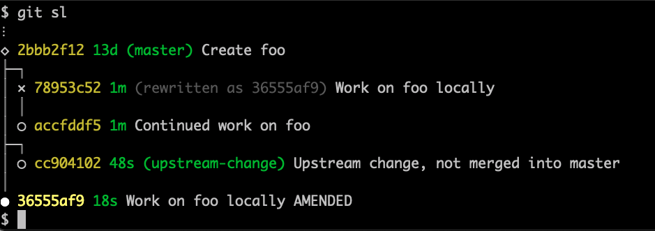

# Branchless workflow for Git

`git-branchless` is a suite of tools to help you **visualize**, **navigate**, **manipulate**, and **repair** your commit history. It's based off of the branchless Mercurial workflows at large companies such as Google and Facebook.

- [Demos](#demos)
  - [Repair](#repair)
  - [Visualize](#visualize)
  - [Navigate and manipulate](#navigate-and-manipulate)
- [About](#about)
- [Installation](#installation)
- [Status](#status)
- [Related work](#related-work)

## Demos
### Repair

Undo almost anything:

- Commits.
- Amended commits.
- Merges and rebases (e.g. if you resolved a conflict wrongly).
- Checkouts.
- Branch creations, updates, and deletions.

Why not <code>git reflog</code>?

`git reflog` is a tool to view the previous position of a single reference (like `HEAD`), which can be used to undo operations. But since it only tracks the position of a single reference, complicated operations like rebases can be tedious to reverse-engineer. `git undo` operates at a higher level of abstraction: the entire state of your repository.

`git reflog` also fundamentally can't be used to undo some rare operations, such as certain branch creations, updates, and deletions. [See the architecture document](https://github.com/arxanas/git-branchless/wiki/Architecture#comparison-with-the-reflog) for more details.

What doesn't <code>git undo</code> handle?

`git undo` relies on features in recent versions of Git to work properly. See the [compatibility chart](https://github.com/arxanas/git-branchless/wiki/Installation#compatibility).

Currently, `git undo` can't undo the following. You can find the design document to handle some of these cases in [issue #10](https://github.com/arxanas/git-branchless/issues/10).

- "Uncommitting" a commit by undoing the commit and restoring its changes to the working copy.
  - In stock Git, this can be accomplished with `git reset HEAD^`.
  - This scenario would be better implemented with a custom `git uncommit` command instead. See [issue #3](https://github.com/arxanas/git-branchless/issues/3).
- Undoing the staging or unstaging of files. This is tracked by issue #10 above.
- Undoing back into the _middle_ of a conflict, such that `git status` shows a message like `path/to/file (both modified)`, so that you can resolve that specific conflict differently. This is tracked by issue #10 above.

Fundamentally, `git undo` is not intended to handle changes to untracked files.

Comparison to other Git undo tools

- [`gitjk`](https://github.com/mapmeld/gitjk): Requires a shell alias. Only undoes most recent command. Only handles some Git operations (e.g. doesn't handle rebases).
- [`git-extras/git-undo`](https://github.com/tj/git-extras/blob/master/man/git-undo.md): Only undoes commits at current `HEAD`.
- [`git-annex undo`](https://git-annex.branchable.com/git-annex-undo/): Only undoes the most recent change to a given file or directory.
- [`thefuck`](https://github.com/nvbn/thefuck): Only undoes historical shell commands. Only handles some Git operations (e.g. doesn't handle rebases).

### Visualize

Visualize your commit history with the smartlog (`git sl`):

</a>

Why not `git log --graph`?

`git log --graph` only shows commits which have branches attached with them. If you prefer to work without branches, then `git log --graph` won't work for you.

To support users who rewrite history extensively, `git sl` also points out commits which have been abandoned and need to be repaired (descendants of commits marked with `rewritten as abcd1234`). They can be automatically fixed up with `git restack`, or manually handled.

### Navigate and manipulate

Rewrite history without fear:

Why not `git rebase -i`?

Interactive rebasing with `git rebase -i` is fully supported, but it has a couple of shortcomings:

- `git rebase -i` can only repair linear series of commits, not trees. If you modify a commit with multiple children, then you have to be sure to rebase all of the other children commits appropriately.
- You have to commit to a plan of action before starting the rebase. For some use-cases, it can be easier to operate on individual commits at a time, rather than an entire series of commits all at once.

When you use `git rebase -i` with `git-branchless`, you will be prompted to repair your history if you abandon any commits.

## About

The branchless workflow is designed for use in a repository with a **single main branch** that all commits are rebased onto. It improves developer velocity by encouraging fast and frequent commits, and helps developers operate on these commits fearlessly.

In the branchless workflow, the commits you're working on are inferred based on your activity, so you no longer need branches to keep track of them. Nonetheless, branches are sometimes convenient, and `git-branchless` fully supports them. If you prefer, you can continue to use your normal workflow and benefit from features like `git sl` or `git undo` without going entirely branchless.

## Installation

See https://github.com/arxanas/git-branchless/wiki/Installation.

Short version: run `cargo install --locked git-branchless`, then run `git branchless init` in your repository.

**NOTE**: due to https://github.com/arxanas/git-branchless/issues/127, you must install with the `--locked` flag for `cargo`.

## Status

`git-branchless` is currently in **alpha**. Be prepared for breaking changes, as some of the workflows and architecture may change in the future. It's believed that there are no major bugs, but it has not yet been comprehensively battle-tested. You can see the known issues in the [issue tracker](https://github.com/arxanas/git-branchless/issues/1).

`git-branchless` follows [semantic versioning](https://semver.org/). New 0.x.y versions, and new major versions after reaching 1.0.0, may change the on-disk format in a backward-incompatible way.

To be notified about new versions, select Watch » Custom » Releases in Github's notifications menu at the top of the page. Or use [GitPunch](https://gitpunch.com/) to deliver notifications by email.

## Related work

See the [Architecture page](https://github.com/arxanas/git-branchless/wiki/Architecture) for work related to the implementation of `git-branchless`.

Alternative tools:

* [`~krobelus/git-branchstack`](https://git.sr.ht/~krobelus/git-branchstack/): A tool which allows you to make all of your commits to one branch, and then automatically split them up into separate branches later based on their topic.
* [`git-stack`](https://github.com/epage/git-stack): This tool helps you create stacked branches and keep them up-to-date.
* [Stacked Git](https://stacked-git.github.io/): This tool lets you efficiently manage a stack of patches alongside your regular work. In comparison, `git-branchless` encourages that you commit all of your work directly and manipulate those commits directly.
* [Git Patch Stack](https://github.com/uptech/git-ps): Similar to Stacked Git, specifically intended to support using a pull request workflow.
* [Jujutsu](https://github.com/martinvonz/jj): An experimental, Git-compatible VCS. Supports anonymous branches, undo, checked-in conflicts, auto-rebase. Uses a completely different CLI (`jj` instead of `git`) and does not work in a Git working copy, but can work as an alternative working copy (like `git worktree`).

Complementary tools:

* [`git-absorb`](https://github.com/tummychow/git-absorb)/[`git-autofixup`](https://github.com/torbiak/git-autofixup): These tools let you take your current changes, at the top of a stack, and intelligently "absorb" them into previous related changes in the same stack.
* [`git-revise`](https://git-revise.readthedocs.io/en/latest/man.html): This tool lets you "efficiently update, split, and rearrange git commits" without touching the working copy.
